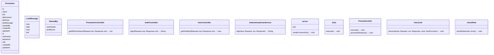

# DIAGRAMA DE CLASSES

```mermaid
	classDiagram
		class Promotion{
			id
			name
			link
			qttAnswers
			qttViews
			lastMessage
			startedBy
			createdAt
			updateAt
		}

		class LastMessage{
			user
			date
			hour
			link
		}

		class StartedBy{
			userStarter
			profileLink
		}

		class Promotion{
			id
			username
			password
			role
			createdAt
			updateAt
		}

		class PromotionController{
			getAllPromotions(Request req, Response res): List<Promotion>
		}

		class AuthController{
			login(Request req, Response res): String
		}

		class UserController{
			getOneById(Request req, Response res): User
		}

		class AuthenticateUserService{
			login(req: Request, res: Response): String
		}

		class server{
			port
			createConnection(): void
		}

		class Jobs{
			execute(): void
		}

		class PromotionJobs{
			execute(): void
			promotionRefresh(): void
		}

		class checkJwt{
			checkJwt(req: Request, res: Response, next: NextFunction): void
		}

		class checkRole{
			checkRole(roles: Array<string>): void
		}
```