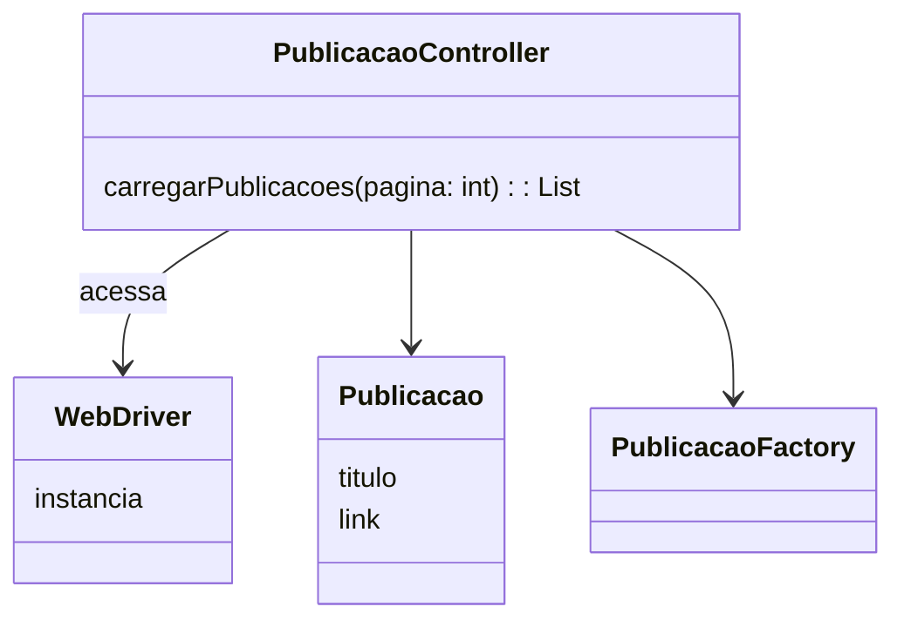

# DIAGRAMA DE CLASSES

```mermaid
	classDiagram
		class Publicacao{
			titulo
			link
		}

		class PublicacaoController{
			carregarPublicacoes(pagina: int): List<Publicacao>
		}

		class WebDriver{
			instancia

		}

		PublicacaoController-->WebDriver: acessa
		PublicacaoController-->Publicacao
		PublicacaoController-->PublicacaoFactory
```