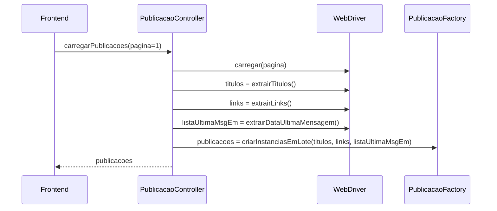
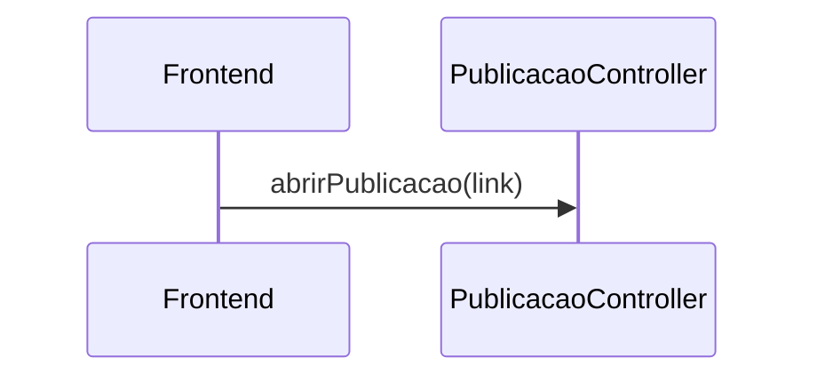

# REQUISITOS FUNCIONAIS
## RF1. Acessar lista de publicações
### casos de uso
```UML
o usuário abre a aplicação | o sistema retorna a lista de publicações
```

---
### wireframe


---
### eventos e operações de sistema
| Evento  | Operação |
| --------| -------- |
| entrar  | carregarPublicacoes(pagina)  |
| recarregar  | carregarPublicacoes(pagina)  |

### diagrama de sequência


## RF2. Acessar publicação
```UML
o usuário clica no título do publicação | o sistema abre o link no navegador
```
### diagrama de sequência


# ATORES
* Usuário
* WebDriver

# REGRAS DE NEGÓCIO